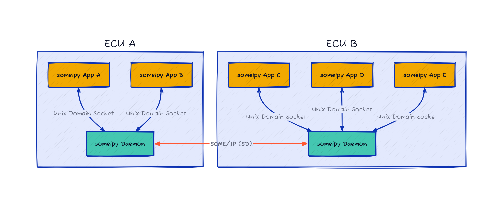

someipy v2: What's New
=========================

This page outlines the new features and changes introduced in version 2 of the `someipy` Python package. Version 2 introduces a new architecture and a refined application API, addressing limitations present in version 1.0.

New Architecture
----------------

`someipy` v2 features a redesigned architecture that eliminates key weaknesses of the previous version.  In v1, each application utilizing `someipy` required its own network interface. Version 2 centralizes network interface handling within a dedicated `someipyd` daemon.

-   **someipyd Daemon:** A new `someipyd.py` daemon is introduced to manage all communication, including:

    - SOME/IP service discovery via UDP multicast and unicast.
    - SOME/IP message exchange (methods, events, fields).
-   **Unix Domain Socket Communication:** Applications using `someipy` communicate with the `someipyd` daemon via Unix Domain Sockets, eliminating the need for direct network access.
-   **Centralized Network Handling:** The `someipyd` daemon handles all network communication, allowing applications to remain lightweight and focused on application logic.
-   **Scalability:** Each ECU or PC can run a single `someipyd` daemon, supporting an arbitrary number of applications.

The diagram above illustrates the new architecture, showcasing the central role of the `someipyd` daemon in managing all SOME/IP communication.

New Application API
-------------------

The application API has been streamlined for ease of use and flexibility. The following snippets demonstrate the core elements of the new API:

.. code-block:: python

    someipy_daemon = await connect_to_someipy_daemon()

Establish a connection to the someipyd daemon.

.. code-block:: python

    addition_method = Method(
        id=SAMPLE_METHOD_ID,
        protocol=TransportLayerProtocol.UDP,
    )
    addition_service = (
        ServiceBuilder()
        .with_service_id(SAMPLE_SERVICE_ID)
        .with_major_version(1)
        .with_method(addition_method)
        .build()
    )

Define a service with its methods, eventgroups, and events.

.. code-block:: python

    client_instance_addition = ClientServiceInstance(
        daemon=someipy_daemon,
        service=addition_service,
        instance_id=SAMPLE_INSTANCE_ID,
        endpoint_ip=interface_ip,
        endpoint_port=3002,
    )

Construct a ClientServiceInstance for service interaction.

.. code-block:: python

    method_parameter = Addends(addend1=1, addend2=2)
    method_result = await client_instance_addition.call_method(
        SAMPLE_METHOD_ID, method_parameter.serialize()
    )
    
    sum = Sum().deserialize(method_result.payload)
    print(f"Sum: {sum.value.value}")

Prepare method parameters, call the method, and deserialize the result.
        

.. code-block:: python

    await someipy_daemon.disconnect_from_daemon()

Disconnect from the daemon.
