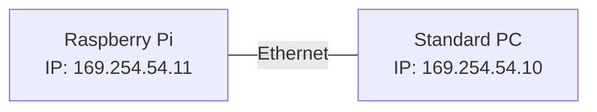

<style type="text/css">
pre > code.language-mermaid {
    display: flex;
    justify-content: center;
    align-items: center;
}

p:has(img) {
    display: flex;
    justify-content: center;
    align-items: center;
}
</style>

# SOME/IP on a Raspberry Pi

This guide provides a step-by-step example of using someipy on a Raspberry Pi 3 Model B+ running Raspberry Pi OS. While the instructions are tailored for this setup, they can also be adapted for any other single-board computers running Linux. The only software requirement for the single-board computer and the operating system is Python 3 support.

The setup used in this tutorial is as follows. The Raspberry Pi (rpi) and the PC are connected via ethernet and the rpi is sending SOME/IP events to the standard PC (host PC).



## Configuration of Host PC

First the proper network settings have to be configured on the host PC. On Ubuntu it can configured via Settings > Network > Wired.
In order to communicate with the rpi you need to configure an IPv4 address in the same subnet as the rpi. In this setup the rpi has the address 169.254.54.11. The host PC's IP address is chosen as 169.254.54.10.


## Installing someipy on Raspberry Pi

**Option 1**

If your Raspberry Pi is connected to the internet, you can use **pip3 install** for installing someipy. Login to your rpi using SSH:

```bash
pip3 install someipy
```
<br/>
**Option 2**

In case your rpi is not connected to the internet, you can download the wheel file on your host PC and copy it afterwards to the rpi. On the rpi you can install the pip package locally from the wheel file:

```bash
pip3 download someipy
# Transfer to rpi home directory
scp someipy-0.0.2-py3-none-any.whl pi@169.254.54.11:/home/pi
```

Login to your rpi and install someipy from the transferred wheel file:

```bash
ssh pi@169.254.54.11
pip3 install someipy-0.0.2-py3-none-any.whl
```

## someipy Application on Raspberry Pi

The application on the rpi shall send out SOME/IP events. For that purpose we will clone the [example application](https://github.com/chrizog/someipy/blob/master/example_apps/send_events_udp.py) from GitHub and the corresponding *temperature message*, adapt the application and copy it to the rpi.

```bash
git clone git@github.com:chrizog/someipy.git
```

Now edit the file *send_events_udp.py* and adapt the *INTERFACE_IP* variable at the top of script. The IP address has to be set to the Raspberry Pi's IPv4 address (169.254.54.11 in this example).

```python
INTERFACE_IP = "169.254.54.11"
```

Now copy the application to the rpi:

```bash
scp someipy/example_apps/send_events_udp.py pi@169.254.54.11:/home/pi
scp someipy/example_apps/temperature_msg.py pi@169.254.54.11:/home/pi
```

Start the application on the Raspberry Pi:
```bash
ssh pi@169.254.54.11
python3 send_events_udp.py
```

## someipy Application on Host

On the host PC the counterpart of the application *send_events_udp.py* has to be used which is the application *receive_events_udp.py*.

Again, edit the app *receive_events_udp.py* and adjust the *INTERFACE_IP* variable now to the host PC's IP address (169.254.54.10 in this example).

```python
INTERFACE_IP = "169.254.54.10"
```

Before starting the application, make sure that your host PC joins the multicast group which is used for SOME/IP service discovery. In this example the service discovery IP address is 224.224.224.245. The network interface is *enp3s0* in this example. Use *ifconfig* to figure out the name of your ethernet network interface adapter.

```bash
sudo ip addr add 224.224.224.245 dev enp3s0 autojoin
```

Afterwards start the application:
```bash
python3 receive_events_udp.py
```

## Troubleshooting
In case the receiving application on the host PC is not receiving any data (not showing any logs), make sure that your network interface settings are correctly set as descibed above.

It is recommended to use [Wireshark](https://www.wireshark.org/download.html) to check whether the service discovery offer entries are received on the host PC. Since version 3.2.0 Wireshark supports a SOME/IP dissector.

Start to capture packets in Wireshark and look for a packet with the destination address *224.224.224.245*, i.e. the service discovery address you configured in your application. Right-click on that packet and choose "Decode as.." and select SOME/IP as the protocol.

Now the packet shall have the info in Wireshark "SOME/IP Service Discovery Protocol \[Offer\]".


If you double-click on the packet, you shall be able to see the instance ID, service ID, etc. in the **Entries Array** of the SOME/IP Service Discovery message:


If the offer entries of your service instance are not shown, ensure that the communication via ethernet is working and the application providing the service is up and running.